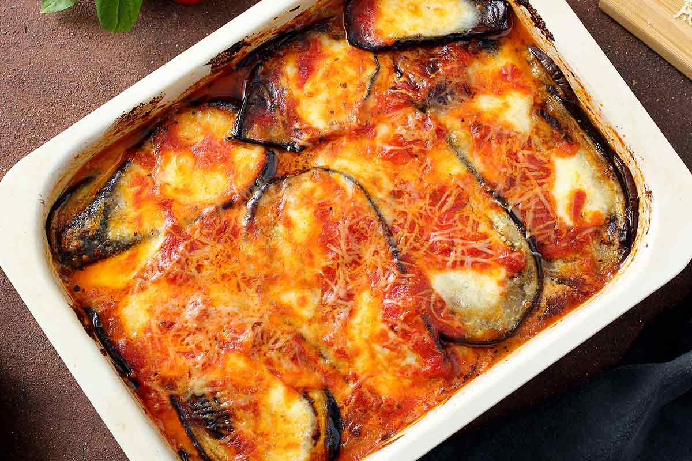
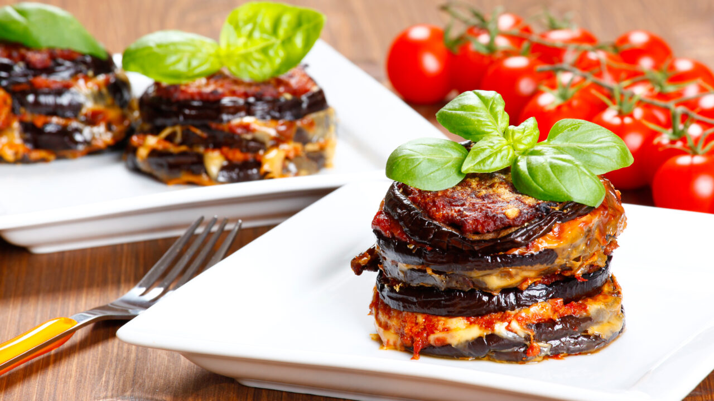
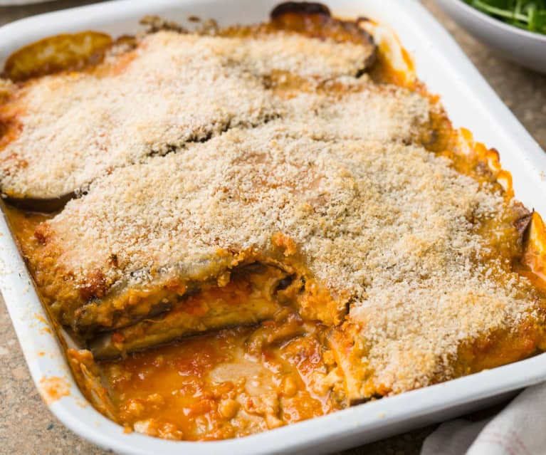
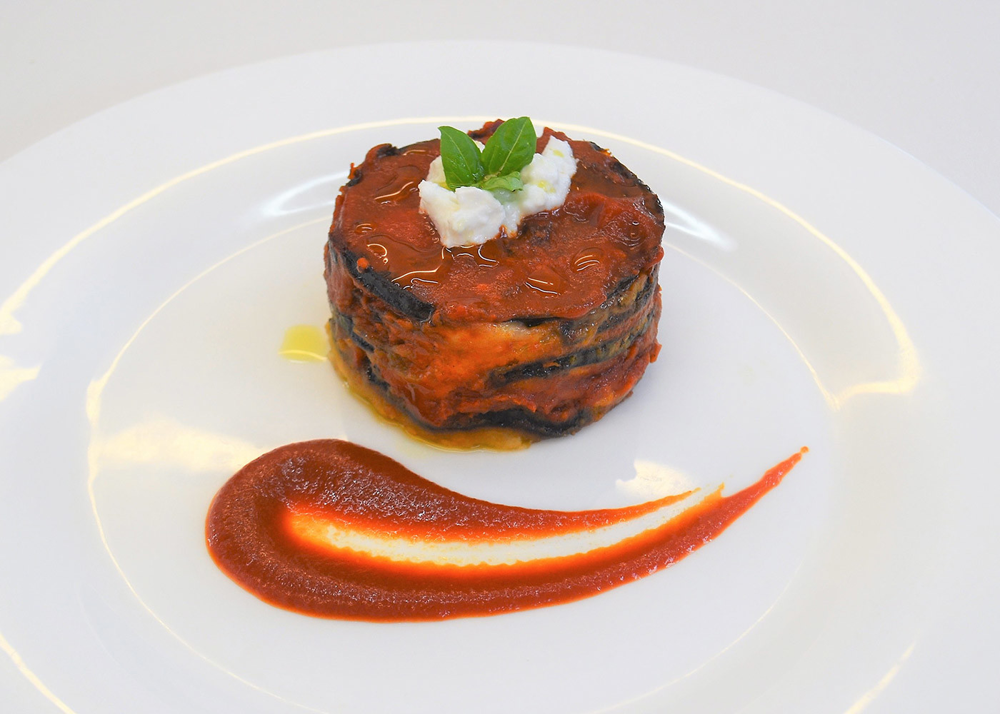
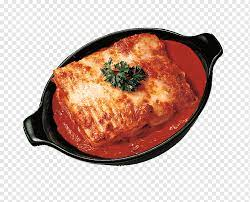
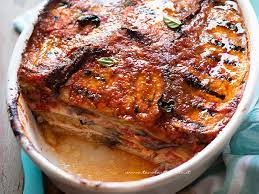

Valutiamo le parmigiane!☆*: .｡. o(≧▽≦)o .｡.:*☆
-

- Molto classica, mi piace che sia stata cotta dentro un lavello sporco 7/10

- Bella la composizione del piatto però quei pomodori dietro per riempire il vuoto interiore di chi ha scattato la foto non mi piacciono 5/10

- Questa è piuttosto strana, quel sugo color problemi al fegato non mi ispira molto 2/10

- Sembra che abbiano lasciato questo piatto in frigo per qualche giorno per poi servirlo con quella striscia di sugo che fai quando ti sporchi il dito e cerchi di pulirti sul piatto  4/10 

- non
- trovo
- parmigiane
- decenti
- a
- aa
- aaa
- comunque carina questa cosa dei puntini messi in questo modo, basta mettere un "-" all'inizio della riga

Sto provando diverse immagini di parmigiane ma hanno tutte una qualità bassissima ┻━┻ ︵ヽ(`Д´)ﾉ︵ ┻━┻

- Questa doveva essere un .png ma la lascerò così... comunque molto carina nonostante siano 3 pixel con un piccolo abete al centro 9/10

- le foglie di basilico sono minuscole mi fanno ridere e sembra una fusione tra della carne alla griglia e acqua sporca dei piatti 10/10
